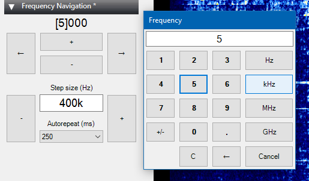

# FrequencyNavigation

Plugin for SDR#. It was written to make it easier to use SDR# on touch screen devices such as Microsoft Surface.

At first I wanted to adapt a positional frequency control for thumb operation. Then I wanted to jump across the frequency spectrum in custom steps. So it provides controls for both these modes of operation.

Compatible with up to dateAirspy SDR# and with opensource forks like [cgommel's one](https://github.com/cgommel/sdrsharp) *(as it was in 2017, the last time I actually touched this code)* .

It can also be compiled with [murphy666 fork](https://github.com/murphy666/sdrsharp_experimental). But that one was dropped in the state which makes it pretty much useless for use with existing plugins.

## Download

Check the Releases section for the binaries.

## Compilation

### Airspy version

1. put the SDRSharp.Common.dll file from SDR# distribution into References folder;
2. build SDRSharp.FrequencyNavigation.Airspy.sln

(Tested with SDR# v1.0.0.1491)

### Open source version

1. put FrequencyNavigation folder into SDR# sources folder;
2. add SDRSharp.FrequencyNavigation.OpenSource.csproj to SDRSharp solution;
3. build it all together.

(You will need [portaudio.dll](https://github.com/spatialaudio/portaudio-binaries) to run SDR# built from sources - put it nearby).

## Installation

### Airspy version

1. put the SDRSharp.FrequencyNavigation.dll file to SDR# folder;
2. put the line ``<add key="Frequency Navigation" value="SDRSharp.FrequencyNavigation.FrequencyNavigationPlugin,SDRSharp.FrequencyNavigation" />`` into Plugins.xml file.

### Open source version

1. put the SDRSharp.FrequencyNavigation.dll file to SDR# folder;
2. put the line ``<add key="Frequency Navigation" value="SDRSharp.FrequencyNavigation.FrequencyNavigationPlugin,SDRSharp.FrequencyNavigation" />`` into SDRSharp.exe.config file, <sharpPlugins> section (not the frontends one).

## Usage

In the upper section of the plugin control panel:
* frequency display with active digit selected. Double click it to open the number pad;
* ``+`` and ``-`` buttons are for changing the frequency. The amount of change is defined by the active digit. Hold them down for autorepeat;
* Arrows are to choose the active digit.

In the lower section:
* text field for frequency step. Double click it to open the number pad;
* ``+`` and ``-`` buttons are for changing the frequency. The amount of change is defined by the text field. Hold them down for autorepeat;
* dropdown box for the rate of autorepeat.

To hold a button on a touch screen, you have to tap and hold it (otherwise Windows will try to do right mouse button action).

Number pad works in the same way as on the majority of test and measurement equipment - type in the number and choose the units to submit it.

## License notes

This is a major stumbling stone that prevented me to publish this plugin on multiple past attempts. (SDR had mostly fallen out from my attention since then, so I never made the final push until now.)

I was never happy about the licensing of the original SDR#. I couldn't just slap any common license on my work in this situation. All I can do is to write down my own concerns, [and so I did](LICENSE.md), finally.

This is an experiment, so let me know what kind of difficulties it causes for you, in case you face any.
